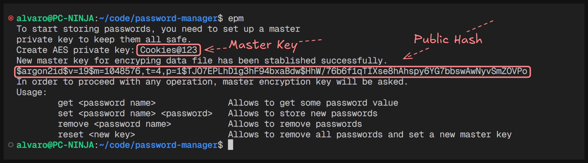
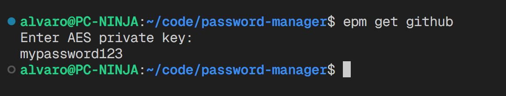
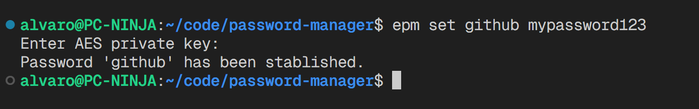
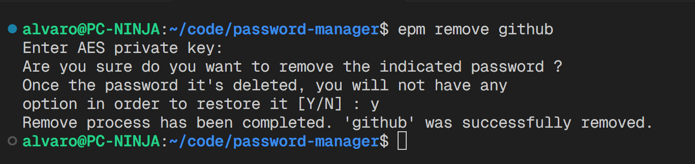
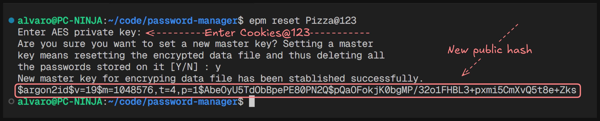

# Easy Password Manager

## Main Idea of Operation

This project is an easy to use but at the same time very secure password manager. All passwords are stored under a layer of AES encryption in its CBC 256 version with a 256-bit (32-byte) derived key stored securely (Aragon in its thickest form) in a protected file on the system.

> It is important to note that the password manager works at the user level, which means that all passwords saved under a system user are invisible to other users.

The program works in such a way that there are two different hashes. One of the two (located in `~/.local/share/epm/epm_aes_key.key`) is a "public" hash in the form of an Aragon2 string (the hash itself includes a section for the randomly generated "salt" value) and this is used only for user authentication. Absolutely any action within the manager requires passing this authentication. The second hash is actually the 256-bit AES key mentioned above; the only difference is that for security reasons this hash is never stored in a system file, but is generated during the execution of the program (it is a "private" hash). Once the user has been authenticated and the manager access key has therefore been set correctly to generate the authentication hash, the corresponding program data file is read, which includes the random value for this second hash (located in `~/.local/share/epm/epm_aes_key_salt.key`) and, together with the manager key, the AES private encryption key is built. Each operation in the manager requires encryption and/or decryption, so the key must be generated each time.

## Installation

The first step is to clone the repository anywhere on our file system.

```bash
git clone https://github.com/panprogramadorgh/password-manager
```

Once the repository is cloned, we will install the Cmake compilation tool with the following command.

```bash
sudo apt install cmake
```

We will locate the project path and create the Makefile with the cmake command.

```bash
cd example/path/easy-password-manager
cmake .
```

To generate the program we will execute the make command in the same location.

```bash
make
```

> After generating the program it is recommended to move it to directories such as `$HOME` or `$`HOME/bin` and add it to the PATH

```bash
mv ./main ~/bin/epm
echo -e '\n\nexport PATH=$HOME/bin:$PATH' >> ~/.bashrc
source
```

## Basic user guide

First of all, if this is the first time you start using the manager, when you launch the program it will make you generate a master encryption key for the data file. To keep passwords safe it is preferable to enter a good master key for the manager, although this problem is largely mitigated thanks to key derivation with Aragon2.

[](images/init.png)

### Arguments

In version 1.0.0 of this project there are four main arguments to the command, three of them focused on password management and one on the manager's master key.

- `epm get <password name>` Allows you to get a saved password

  [](images/get.png)

- `epm set <password name> <password>` Allows you to save a new password (it is not possible to set the same password multiple times, if you want to change the value you have to delete it first)

  [](images/set.png)

- `epm remove <password name>` Allows you to delete passwords (requires additional confirmation)

  [](images/remove.png)

- `epm reset <new key>` Allows you to delete all passwords saved so far and set a new encryption key (requires entering the old encryption key, although to achieve a similar effect you can force the deletion of the key or data file, causing corruption and forcing the program to start the initialization process again).

  [](images/reset.png)
